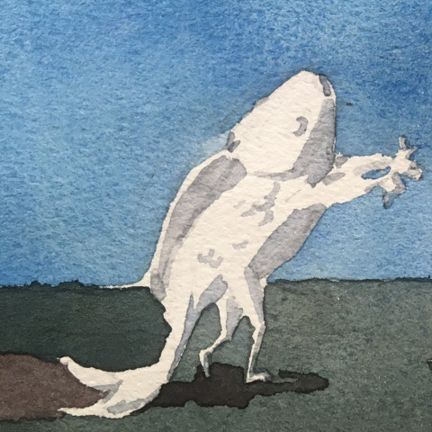

..
   WARNING

   This README is used to display on the Github repository page, so it cannot
   contain any Sphinx stuffs (directive or role).

====================
|logo| Silver Bullet
====================

Sphinx_-powered note-taking system of SilverRainZ_.

There are some articles_ describes the architecture of this note-taking system.

.. _Sphinx: https://sphinx-doc.org
.. _SilverRainZ: https://github.com/SilverRainZ
.. _articles: https://silverrainz.me/blog/category/%E6%88%91%E5%A6%82%E4%BD%95%E7%94%A8-sphinx-%E5%BB%BA%E7%AB%8B%E7%AC%94%E8%AE%B0%E7%B3%BB%E7%BB%9F.html

Browse
======

Visit https://silverrainz.me/ (hosted by Github Pages).

For visitors in China, there is a Gitee Pages mirror: https://silverrainz.gitee.io/

位于中国的访客可以访问 Gitee 镜像： https://silverrainz.gitee.io/

Dependencies
============

You MUST have following programs installed:

- Git
- GNU make
- Python>=3.9
- Sphinx>5

Install python package dependencies by the following commmands::

   pip3 install --user -r requirements.txt

I developed `series of sphinx extensions`_ for my note-taking system.
You can found them in the requirements.txt_:

.. _series of sphinx extensions: https://github.com/sphinx-notes
.. _requirements.txt: requirements.txt

The following programs are OPTIONAL if you don’t need to build various contents
embedded in the documentation:

- Lilypond
- Timidity++
- FFmpeg
- ImageMagick
- Graphviz
- PlantUML

Build
=====

Firstly clone this repository (The repository is quite big,
clone with ``--depth=1`` if you dont want to make any changes)::

   git clone https://github.com/SilverRainZ/bullet.git

Ask sphinx to build HTML documentation::

   make

Root page of the HTML documentation can be found at ``_build/html/index.html``.

LICENSE
=======

Copyright 2020-2024, Shengyu Zhang.

The contents of this repository/documentation are all published under
|cc-badge| Attribution-ShareAlike (CC BY-SA) agreement. For more details,
please refer to: LICENSE_.

.. |cc-badge| image:: https://licensebuttons.net/l/by-sa/4.0/88x31.png
   :target: http://creativecommons.org/licenses/by-sa/4.0/
   :height: 1.5em
.. _LICENSE: /LICENSE
