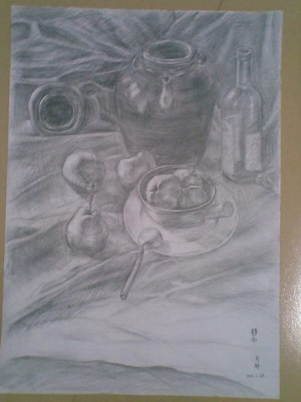
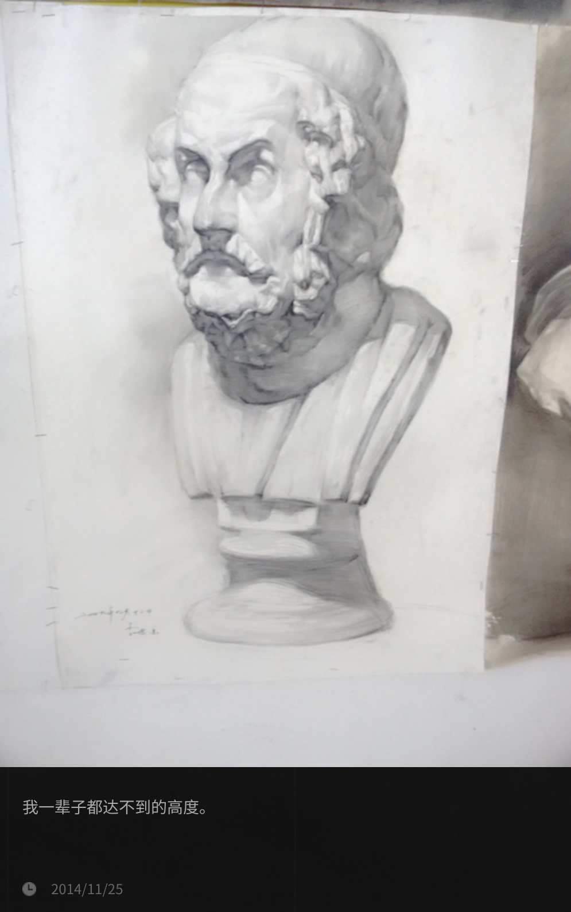

================
辞职为学画（一）
================

.. post:: 2023-12-10
   :tags: 生活,绘画
   :author: LA
   :language: zh_CN
   :category: 辞职为学画
   :location: 杭州

.. hint::

   这是一篇搁了好几年的草稿，后半段迟迟无法下笔，近年的心境已与那时大不相同，
   现在写出来总觉得自己在说谎，只好把一部分摘出来，让它得以见天日。
   希望有机会把后面的内容补完吧。

.. centered:: :del:`如果有哪一天我获得了幸福，我就再也不画画了。`

:del:`今年` :del:`去年` 前年 6 月的时候，我结束了在 :event:`燕郊的课程 <造型实验室>`，回家准备 :doc:`面试 </notes/writeups/2021-interview/index>`；9 月，入职杭州字节，还是写代码。这一年间有不少朋友听说了我的事情，问为什么突然辞了职去学画画；面试的时候也会被问，你为什么选择这么做，现在怎么又回来了云云，我也一遍又一遍地重复着准备好的说辞。

我有个坏毛病，在人前时总想着说些漂亮话，羞于暴露自己「和别人不一样」的一面：

:某: 你辞职是为了追求梦想吗？
:我: 我就玩一玩，玩够了就接着回来打工，说不定到时候还要你帮忙内推呢😂️

回答差不多总是这样子，并不是说谎，我不期望这一年里能画出什么名堂，计划上过了一年就回来继续上班，结果上也确实如此。只是回想起这些话，总觉得难过，有些对不起自己。

*我不是这样想的。*

.. contents:: 目录
   :local:

模糊的萌芽
==========

我从小喜欢画画，但画画是什么东西？我从来没想过。

三年级的时候因为搬家转学，新学校的体育老师是个白了一半头发的大肚子爷爷，村里的小学没有什么体育设施可言，每次上课的时候只要让大家在沙地上集合点名，从储物间里拉出两箩筐七零八落的器材，大家一拥而上，先到先得。箩筐里有凑不成对儿的铁质羽毛球拍、花花绿绿的跳绳、总是不太有精神的篮球。爱打球的小朋友要是没抢到打满了气的好球，可以跟老师要球针，憋红了脸吹一吹还能顶一节课。

学校那会儿已经盖起了三层的教学楼，但体育老师的办公室还在平房的一个小单间里，没课的时候他在屋里画国画，那个时候他就是我的对画画认知的全部来源。我已经忘记我是怎么缠着他跟他要画儿的，能记得的是他给过我两张画，其中一张题字「小草」，前景是浓墨画的一奇石、两丛草，远景是淡淡的三座山。我将其视作珍宝，在还没长大的很长一段时间内，我的所谓「画画」就是一遍又一遍地，临摹老师送我的这张小画。

那时候还太小，临摹里没有加入任何的思考，画了百十张自然也收获缺缺，尽管如此也能收获周围的小朋友的夸赞。现在想来，我和他们的区别仅仅是我能坐得住，能在不用上课的日子里，趴在顶层的楼梯间里一声不吭地画一个下午罢了。

长大了一点开始能看懂非低龄向的动画片，星空、华娱那时候会播各种引进的动画片，《火影忍者》、《魔法少女小樱》、《犬夜叉》、《闪灵二人组》…… 我的兴趣就从涂墨水变成了临摹纸片人。现在回想起来感慨得很，我的哥哥姐姐那时候也和我一起看，为什么只有我长大之后成了老二次元呢？

喜欢这些动画片很大原因是因为里边炫酷的打打杀杀，自己也会画很多小人打打杀杀的场面，大部分在课本上，哪一科的老师越无聊，书上的战斗就越精彩些。「正经」画画的时候会临摹各种印刷品上的纸片人，可能是作业本的封面，也可能是特地买的动画片贴纸。我不是一个非常耐心的人，用自动铅匆匆把线稿画好之后，就想着快点勾线，上色，享受「完成」的成就感。这样画出来的形象，其实是非常不准的，但和更小的时候一样，同学们都不画画，就显得我画得很好一样 —— 直到我的姐姐画了她的第一张画。

姐姐是一个极聪明又有耐心的人，就我所知平时也不画画，有一天她突然窝在房间里很久，出来时给我看一张犬夜叉的线稿：非常干净的线，而我的纸上全是橡皮揉擦的痕迹。更重要的是，这太像了，和原画的观感一模一样，我甚至怀疑这是拓印的，但这显然不可能，姐姐不会说谎，两张画的大小也不一样。

这件事情在当时让我有些妒忌，但长远看来没有什么其他影响。姐姐之后就不再画了，她的时间更多的花在课业上，而我也没有被触动然后奋发图强云云。现在想起，只是感叹 *自己「没有天赋」这件事情，从很早以前就有迹可循了* 。

勤奋的兴趣生
============

中考我差了三分没能上区一中，去到了顺位下来的另一个高中。这个学校文化课成绩不好不坏，美术倒是无可争议的全区第一（社团活动也很丰富，我在这里有了编程的启蒙）。那时我尚不懂「美术高考」为何物，只知道大家都是在教室里上课，一年升一级，参加一样的考试，划线决定下一个学校。对于这种认知外的选择，我根本不会去有什么妄想。

学校在高一学生里招募打算参加艺考的学生组成专业班，同时也开设了画着玩儿的兴趣班。专业班的同学连续三年都由同一个美术老师指导，前两年下午放学后都要到艺术楼的画室里画画，最后一年则是外出集训，学生外出集训的当年老师便兼任兴趣班。因此兴趣班只持续一年，只接待高一的学生，强度上自然也不如专业班，退出机制也简单：不想上，就不上了呗。

对这些事情有了解都是后来的事情了，当时听到兴趣班的消息的我充满了一种对未知的好奇，这听起来是在我认知内的：不需要慎重的考虑，一学期一百块钱的材料费就能上。于是我兴冲冲报了名，还反复考虑：「在要不要去的时候把以前的画给老师看」，「老师会不会夸我啊」云云。

上课之前要准备铅笔和纸。我一直以为，只要是白纸就能画画，之前画「国画」虽然知道老师用的是宣纸，也从来没想过去买，一直用的是家里撕下的日历纸，白且大，当然「枯干渴润湿」的变化就不用想了，这样的纸仅仅是能沾上墨而已。当时住校也没有日历纸，我带上了平时做作业用的本子。

.. figure:: /_images/resign-for-painting/14340257593_652377082.jpg
   :width: 70%

   网上找到的同款图片

   封面看起来比小时候用的厚多了

到了画室才发现大家带的纸和我不一样，足足有一张小课桌那么大，装在一个同样大的袋子里。画室里的桌子看起来好少，中间的空地上摆了非常多的木架，架上放着一块块的「砧板」。在一大堆人里我开始局促不安，想给老师看画的念头完全抛到了脑后，取而代之的是各种各样的疑问：

   | 为什大家的纸都和我不一样……
   | 桌子那么少，我现在是不是没位置了……
   | 我带着做作业的本子会不会很好笑……

老师让大家把纸贴在「砧板」上，竖着放上架子 —— 铅笔削尖 —— 手伸直 —— 练习「拉线」。我硬着头皮把从本子上小小的纸撕下，贴在了大大的板子上，拿起红黑相间的中华铅笔，僵硬地伸直手，左一下，右一下，拉起线来。

不一会儿我就知道了，这是素描纸，这是画架，这是 :artwork.size:`四开 <4k>` 大的画板，我要画的是 :artwork.medium:`素描 <铅笔>`。我当然听过「素描」，难堪里不由得又冒出几分激动，于是更认真地在小小的一方纸上来回拉线，满心想让老师快点注意到我，以后教我更多的东西。

拉几条线当然不能让老师注意到我，但不久后这个愿望还是实现了：每上一堂课，周围的人就少一大半，也许是觉得整天画线很无聊吧，到了画几何体结构的时候，人员基本上稳定在了十来人。某天老师在衬布上摆了一个石膏罐和几个水果，说你们几个可以不用画几何体了，来画静物，带光影的。

于是我们几个人围了过去，换纸，削笔，一开始大家的画板都是横着放的，在下一张画的时候也没想过有什么改变。可我总觉得面对的这样一组静物，取景框是横的总显得奇怪，于是我把画板竖了起来。老师看见一堆画板里只有我的构图是竖着的，便过来夸奖了我一番，也许是从那个时候记住了我的名字？这就无从得知了。

.. figure:: /_images/resign-for-painting/1634486382099.jpg
   :width: 70%

   第一张全因素素描

初学者的第一张画，除了构图之外再没有可圈可点之处了。当然那时候不这么想，我是一个极渴望被夸奖但又不敢表露的人，老师的夸奖给了我非常大的动力。我开始严格规划自己的每一天：

- 中午不休息，回寝室借着中午的太阳晒热的水洗澡（那时候宿舍没接热水，打水洗澡浪费时间）
- 那时候已经参加了计算机社团，洗完澡有时会去图书馆看 :zhwiki:`电脑爱好者`，或者用自己的小小手机看提前下载好的技术资料
- 下午一放学就飞奔到艺术楼，开始上课
- 六点五十，匆匆下楼到小卖部买两块钱一杯的奶茶和一块钱一个的奶油面包，赶在七点夜自修铃响之前回教室吃

这样的生活持续了大半个高一，时至今日，想起奶油面包的味道我还是觉得想吐，:del:`奶茶倒没有喝腻`。

努力当然就会有起色，与此同时隔壁专业班的学生还处于享受高中生活的懒散阶段，大家慢慢知道隔壁兴趣班有个画得比专业班还好的小个子，上课的时候会有人从隔壁探过头来看，我的虚荣心那时候得到了极大的满足。

*可惜留给我的时间不多了。*

努力与选择
==========

艺术楼里有三间画室，在我高一那年，从外到里分别是，兴趣班，高一专业班，高二专业班。每天准备离开的时候，其他画室基本上都没人了，我会开灯溜进去看看他们在画什么。

排除有童子功的同学，美术生的画力基本是按年级来分的。

高一开始基本只用四开的板子，画瓶瓶罐罐石膏体，上学期末或者下学期开始摸一摸水粉。

高二画石膏像、人像、更复杂的静物组合，画得好的同学可以开一张半开的 :zhwiki:`大卫像`，收获一整个画室艳羡的目光。

到了高三，画室慢慢变宽敞起来，学长学姐们已经把在基础课都走过一遍，放眼望去静物架上个个是老相识了。他们开始挑选集训的画室，想考清华央美的就去北京，想考国美的去杭州，想留在省内的，那就去广州。

集训回来后的学长学姐明显不一样了：速写再不需要起稿，一出手型就是准的，画出的线条没有磕磕绊绊的感觉。完成的一张画里很难找出哪里有不和谐的地方，似乎他们对如何在纸面上模拟这个世界，有了十足的把握。

这样的分层给我一种错觉：只要我升上高年级，我也能画得和他们一样好吧。我没有想到的是， *因为选择不同，我和专业生们走上了截然不同的道路。*

高一的第一个寒假，和我过去的任何一个长假一样：我在家里呆着，看电视，写作业。和之前不同的是，我是一个画画的人了，我得画画呀。我买了一本那时候很流行的于小冬速写集，只要把这本书临完，我也可以不用起稿了吧？我还想画素描，从画室借了一本静物书，没有画架，就把四开纸铺在地上趴着画。

   寒假在家临摹的唯一一张素描

   签名是回学校之后让伟敏帮我签的，我那时候还没开始「练字」

看起来是很积极的规划，假期很快过去了，我并没有画多少张。

回想起来我一直是这样的，总会在某个时间段的开始给自己画一张美好的蓝图，*填满时间表给我一种掌控一切的愉悦感，而这份愉悦总会在接下来的实施里统统还回去。*

寒假结束，回到画室，我一边懊悔着虚度的寒假，一边祈祷着同学们假期只顾着疯玩，最好一张都没有画。实际情况是，专业班的学生们按照惯例参加了校外的画室。这个寒假的几乎每一天，他们都在画画 ——

-  我兴奋地规划自己的时间表，他们在画画；
- 我不慌不忙地写寒假作业，他们在画画；
- 我看电视，写代码，他们在画画；
- 当我终于觉得自己应该画画的时候，老师也许在给他们改画了；

一个寒假过后，我已经画得不如他们了 —— *选择走专业的他们，在正确的引导下付出了压倒性的时间成本。在这些面前，我的那么点努力算什么呢？*

在之后的好多年里，我陷入了对自己是否热爱画画的反复质疑。

   挂在艺术楼里的优秀作业 [#]_

   我以为这是我「永远」都达不到的高度。

编外人员的挣扎
==============

高二，文理分科。对于专业生而言，如果后悔学美术了，这是不算太晚的退出时机；而对于想要转专业的兴趣生，这也是能赶上进度的最后机会，如果不转的话，兴趣生的课程也就结束了。

这时候专业生们要面临的道路，对我来说已经不再是认知外的事情了，甚至，它们成为了我生活中习以为常的一部分 —— 我动了一点想转专业的心思。

拦在我面前的问题有两个：

- 学画画很花钱，在 2012 年的时候，普通的外出集训的也要每月近万（其实我没有真正了解过，但印象是这样），即使集训完，艺术类专业的花销比普通专业依然大得多
- 在家里人看来，画画是文化课不好的孩子的选择，我的成绩还不赖，没有冒险换赛道的必要

我委婉地，旁敲侧击地跟父母表达了我的想法，自然没有得到支持。我也不争不吵，生了几天闷气后，一头扎进在时间的河里顺流而下。等再浮出水面的时候，我已经是高二的理科生了。

高一带我兴趣班的 :people:`蔓纯老师`，送走了带了三年的专业生，现在开始带高一的专业班，一直持续到他们高三出去集训。
其实我在之前就和蔓纯老师表达过我的忧虑，她说没关系，到时候你可以来高一的画室画。

尽管得到了这样的许诺，开学后我也没有马上回到画室。每天下课后就和同学一样排队洗澡，去食堂吃热腾腾的饭菜，多出来的时间就四处游荡。可能是觉得回去搞特殊很害羞，也可能是心生了退意，毕竟我 ——「并不是真的热爱画画」。

但学期近半的时候我还是回去了，那一天好像安排了大扫除，下午放学比平时早些。蔓纯老师看到我的时候挺惊讶，以为我不会再来了，怪我为什么没有一开学就过来，本来要交的材料费也帮我免掉了，瞒着父母回画室的我，连一百块钱的材料费都拿不出。就这样，我回归了画室生活。

回看那段生活是沉闷的，我的痛苦就是从那时候开始悄悄滋长。在一堆高一的小同学面前我好像虚长了一级，明明是学长卻还怯生生的 —— 于是我用沉默来避免露怯。老师推荐我画水彩，说既然不考学，就没有必要画枯燥的素描（尽管我从来不这么觉得）。

学新媒介是好事，可是水性材料并没有那么好入门，在竖着的画架上，流动的水更加难以控制，这样的困难让我变得很沮丧。老师很忙，顾不上我，绝大部分的时间我只能自己画；来画室不再是一件值得期待的事情。

.. note:: 很后来才知道画水彩应该用水平式的画架，比如：:search:`荷尔拜因 WL-63`。

后来慢慢和画室里的一些可爱学弟熟悉了，我才不那么沉默，但没办法开心起来。 *我自然而然地升上了高二了，可我没有自然而然地变得厉害起来。* 我眼睁睁地看着隔壁同级的专业生开始画石膏，画人像，粗糙的线条慢慢收敛得干净，干瘪的造型也慢慢变得饱满。我们已经不在一条道路上了，差距越来越大本就正常。可是我却没理由地怪罪自己，把自己的止步不前和他们的飞速进步通通归咎于自己的不努力，自己不够热爱画画。

在这样的自戕里，我变得自卑，敏感，外化出来的是情绪的剧烈波动和无休止的嗜睡。那个时候的小孩总会有些别的烦恼，我也一样不缺， *这些东西后来纠集在一起，滋生了一只黑狗紧跟我至今。*

无论狗来不来，时间都不会停下脚步，高二下学期，高考的紧张感已经慢慢浮现了，我开始觉得自己不应该把多余的精力分摊在画画和编程上了，于是我退出了社团，告别了画室。

.. centered:: 待续……

追记：害羞还是怯弱？
====================

:del:`在写下这段文字的时候才我意识到，那时候最遗憾的事情既不是没有钱，也不是父母的偏见，而是我从来都没有考虑表达自己的真实感受。`

:del:`从小到大我总是被教育要懂事，给人添麻烦是不懂事，想要喜欢的东西是不懂事。等我意识到自己被塑造成了一个羞于表达需求的小孩儿时，我的脸上早就没有一点小孩子的痕迹了。`

:del:`要是我那时候那时候和父母争吵一番呢？我想要画画，我想要和他们一样变得厉害，我想要确认自己不是不喜欢画画。结局我想不会改变，可是我心里那颗不甘心的种子，就不会种下了吧。`

写下上面这段话的时候还是 21 年的年底，两年过去，我又不太赞同那时候的自己了。我一直是个极端厌恶风险的人，所谓「没有表达自己的真实感受」也只是没有下定决心想要画画，如果我表达出来了，那我又该如何和别人展示自己那不存在的决心呢？

2023 年 12 月 10 日，我觉得自己是个胆小鬼。

脚注
====

.. [#] `谷月轩 @ LOFTER 2014/11/25`__

__ https://silverrainz.lofter.com/post/39aab0_3e1e1f2
